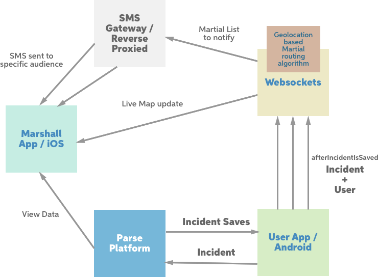

# CAMS
Crowd Sourced Centralised abuse management system

## Description
There is 1 policemen on 240 people and they are there to maintain law and order but simply get outnumbered. They also don't have a reach in to deep evil roots of society.

Here is CAMS, which enables every common man to help resolve crime and abuse in society.

How? You might ask.

Common man using the app. He can autheticate in the app and click a picture of the incident. The incident is tagged with geolocation, date time and the person who reported it. It can be optionally tagged with crime category and description text.

Moderators. We call them Martials. Each Martial has an area assigned and he will receive real time notifications of such incidents. Now its upto him to verify the incident and acknowledge it. All incidence have a recency and urgency tag as well. They are intelligently routed to Martials and events which are already acknowledged by any Martial will not be shown further.

## Tech Stack
- Swift / iOS App
- Java / Android App
- Javascript / Websockets
- Parse / BaaS, Javascript
- SMS Gateway / Reverse Proxy

## Architecture

